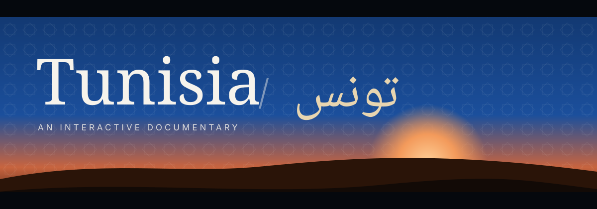

<p align="center">
  
</p>

<h3 align="center"><em>Between the Mediterranean and the Sahara: one shoreline, three thousand years, nearly twelve million voices.</em></h3>

<p align="center">
  A scroll-driven documentary about Tunisia's land and people, in English, Français and العربية.<br/>
  Astro · TypeScript · GSAP ScrollTrigger · Lenis · Leaflet · Chart.js
</p>

---

## FADE IN

> *Black. The letterbox bars hold. A slow drift over the Gulf of Tunis.*
> *Letter by letter, **Tunisia** rises out of the dark; beside it, **تونس** is written in from right to left.*
> *The bars open and the journey begins.*

The site is laid out like a short film in four chapters and an ending:

| Scene | What happens on screen | Under the hood |
|---|---|---|
| **Cold open (Hero)** | Ken Burns crossfade over three coastal shots, letterbox bars, the bilingual title reveal, a door motif, a scroll cue | CSS keyframes for the slideshow, a GSAP intro timeline, a scrubbed exit |
| **I. The land** | Eight pinned chapters slide sideways: Sidi Bou Said & the Medina, Carthage, El Jem, Kairouan, Djerba, Tabarka, Matmata, Tozeur / Chott el Jerid / Sahara. Each has a poem, key facts and its governorate's census population | `ScrollTrigger` pin with `containerAnimation` parallax and snapping. Mirrored for RTL. Becomes a vertical sequence on mobile or with reduced motion |
| **II. Twenty-four governorates** | A choropleth of all 24 governorates. Hover, tap or use the button list to see the name, capital, population, share, rank and a photo | Leaflet with GeoJSON and no tile server (fast, no third-party tiles), loaded when the section comes near |
| **III. The people** | Counters that count up, a line chart from 1960 to 2025, an urban/rural doughnut, age bands, and a bar chart by governorate | Chart.js (tree-shaken), loaded on demand. Each chart has a data table and a source line |
| **IV. Culture & daily life** | A parallax mosaic: crafts, cuisine, music, festivals, and Tunisia today (cafés, the city, engineers, artisans) | `clip-path` reveals and per-tile depth |
| **Fade out** | A desert sunset, a closing line in two scripts, and the credits | A scrubbed sun, followed by a footer that lists every source and every photo credit |

Across the whole site: film grain, a cursor ring on fine pointers, a reading-progress line, and an **ambient soundscape** (sea swell, desert wind and a low drone) synthesised in the browser with the Web Audio API. Sound is **off by default** and starts only when the visitor presses the button.

---

## Design direction

- **Palette:** Sidi Bou Said blue `#1B4F9C` · whitewash `#F6F3EC` · Sahara sand `#E8D5B0` · olive `#5F6E31` · terracotta `#A44B30` · deep Mediterranean teal `#0D5C63` · night `#0E141C`. The sections alternate between night and daylight like changes of scene.
- **Type:** *Cormorant Garamond* for headlines, *Inter* for text and *Amiri* for Arabic. Fonts are self-hosted through Fontsource, limited to the Latin and Arabic subsets, and the hero face is preloaded. On `/ar/` the whole type stack switches to Amiri, and Latin becomes the accent script.
- **Motifs:** all motifs are original SVGs in `src/components/Motifs.astro`. They include a studded horseshoe-arch **door** (its studs are placed by code), an eight-point **zellige** star tile, and a woven **Amazigh** band of chevrons and lozenges.
- **Motion:** slow expo easing, letterboxing, a clip-path "film" wipe on the chapter images, and a horizontal travel that snaps to each chapter.

## Folder structure

```
.
├── data/
│   ├── population.json        ← every figure with its source id, year and status (verified / derived / todo)
│   ├── credits.json           ← photo credits (filled from the Commons API) + data/type/sound credits
│   ├── images.json            ← image "slots": Wikimedia Commons file, tone colour, alt text in 3 languages
│   └── source/                ← raw geoBoundaries ADM1 GeoJSON (ODbL)
├── public/
│   ├── data/governorates.geojson   ← simplified boundaries (20 KB) built by `npm run geo`
│   └── images/                     ← AVIF/WebP renditions built by `npm run images` (git-ignored)
├── scripts/
│   ├── fetch-images.mjs       ← Commons → license check → sharp (AVIF/WebP + blur-up) → credits.json
│   └── build-geo.mjs          ← mapshaper simplification of the boundaries
├── src/
│   ├── components/            ← Hero, Journey, MapSection, People, Culture, Closing, Footer, Nav, Picture, Motifs…
│   ├── i18n/strings.ts        ← all copy in en / fr / ar (typed)
│   ├── layouts/Base.astro     ← <html lang dir>, meta, hreflang, fonts, motion flag
│   ├── lib/data.ts            ← data access + responsive image resolution
│   ├── pages/                 ← /, /fr/, /ar/ (static, one per language)
│   ├── scripts/               ← main (Lenis + GSAP), journey, map, charts, cursor, sound, credits
│   └── styles/global.css      ← tokens, sections, RTL rules, reduced-motion rules
├── netlify.toml · vercel.json
└── README.md
```

---

## Run it

Requires **Node 20.3+** (22 recommended).

```bash
npm install
npm run dev          # http://localhost:4321  (/fr/ and /ar/ for the other languages)
```

Optional, but recommended before a production build:

```bash
npm run images       # download, license-check and optimise every photo, then refresh credits.json
```

```bash
npm run build        # runs `images --soft` (prebuild), `astro check`, then `astro build` → dist/
npm run preview      # serve dist/ locally
```

Without `npm run images` the site still works. Each photo is then served straight from Wikimedia Commons as a responsive `srcset`, and the footer loads the author and license of each file live from the Commons API. When the optimised files exist in `public/images/`, the pages switch to `<picture>` elements with **AVIF and WebP sources** and an inline **blur-up** placeholder.

## Deploy

Both hosts run `npm run build`. The `prebuild` hook fetches and optimises the photos on the build machine, so the generated images never need to be committed.

**Vercel**
1. Push the repository to GitHub and import it at <https://vercel.com/new>.
2. The framework is detected as Astro. `vercel.json` sets the build command, the `dist` output folder and immutable caching for `/_astro/*`.
3. Optional: set `SITE_URL` (for example `https://tunisia.example.com`) so the canonical and `hreflang` URLs are absolute.

**Netlify**
1. Choose *Add new site → Import an existing project* and pick the repository.
2. `netlify.toml` already sets `command = "npm run build"`, `publish = "dist"`, Node 22 and the cache headers.
3. Optional: add the `SITE_URL` environment variable.

Or use the CLIs: `npx vercel --prod` / `npx netlify deploy --build --prod`.

---

## The data rules

> **Never invent a number.** Every figure on the page comes from `data/population.json`, and every entry there names its source and its year.

| Figure | Value | Source |
|---|---|---|
| Total population (6 Nov 2024) | **11,972,169** | INS, RGPH 2024 |
| Population of the 24 governorates | INS, RGPH 2024 | The 24 figures **sum exactly to the national total**, which was checked when the file was generated |
| Growth 2014–2024 | +989,415 · 0.87 %/yr | INS, RGPH 2024 |
| Women / men | 50.7 % / 49.3 % | INS, RGPH 2024 |
| Urban / rural | 72 % / 28 % | INS RGPH 2024 thematic analyses (as reported by *La Presse*) |
| Age bands 0–14 / 15–59 / 60+ | 22.8 % / 60.3 % (derived) / 16.9 % | INS, RGPH 2024 |
| Census totals 1966–2014 | see JSON | INS (1966–1994 are given to the nearest thousand) |
| Annual series 1960–2025 | World Bank `SP.POP.TOTL` | These are modelled mid-year estimates, so they run higher than the census. Both series are shown and labelled |

**Open TODOs (intentionally empty until verified):**
- `censuses[1956]`: published figures differ (≈3.44 M vs ≈3.78 M, depending on whether non-Tunisian residents are counted).
- `ageStructure.fiveYearBySex`: the five-year age groups by sex still have to be transcribed from the INS table. Until they are, the pyramid falls back to the verified broad bands and shows a TODO note.
- `images.json → youth`: a freely licensed photo of young Tunisians, chosen with care.

## Images, credits and respect

- Only **Wikimedia Commons** files are used, and `scripts/fetch-images.mjs` **rejects anything that is not CC0, CC BY, CC BY-SA or public domain**.
- The author and license of each photo are copied from the Commons metadata into `data/credits.json` and shown in the footer. Nobody types attribution by hand.
- Each photo has alt text written for it in all three languages.
- The selection shows heritage *and* the country today: Avenue Habib Bourguiba at night, café life, the Tunis skyline, the INSAT engineering school and a working artisan. No exoticising or stereotyped portraits of people.

## Accessibility and performance

- Semantic landmarks and a skip link. Every chart has an `aria-label`, a visible source line and a data table that can be expanded. The map has a keyboard-friendly list of the 24 governorates, and its info card is an `aria-live` region.
- Each language is a separate static page with the correct `lang` and `dir`. `/ar/` is fully mirrored: navigation, journey direction, chart axes and progress bars.
- `prefers-reduced-motion` is checked before first paint. With it set, the site skips Lenis, the pinning, the Ken Burns zoom, the grain jitter and the count-ups, and shows everything in place.
- Leaflet, Chart.js and the credit fetcher are code-split and only load when their section comes near. The CSS is inlined. Below-the-fold animations are set up when the browser is idle.

**Lighthouse** (mobile emulation, local `astro preview`, with photos unavailable in the measuring sandbox):

| Page | Performance | Accessibility | Best practices | SEO |
|---|---|---|---|---|
| `/` | 91 | 100 | 96* | 100 |
| `/fr/` | 88 | 100 | 96* | 100 |
| `/ar/` | 85 | 100 | 96* | 100 |

\* The only best-practices finding is a set of console errors from the blocked image host in the sandbox. On `/ar/`, the main cost is the size of the Amiri Arabic font. Re-run Lighthouse on your deployment after `npm run images`.

## Credits

Population data: Institut National de la Statistique (ins.tn) and the World Bank. Boundaries: geoBoundaries / © OpenStreetMap contributors (ODbL). Photographs: Wikimedia Commons contributors, as credited in the footer and in `data/credits.json`. Typefaces: Cormorant Garamond, Inter and Amiri (SIL OFL). Motifs and sound: original work.

<p align="center"><em>FADE OUT.</em></p>
